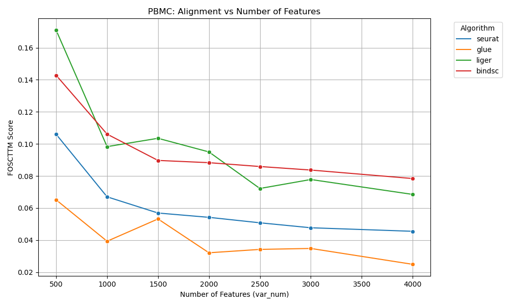
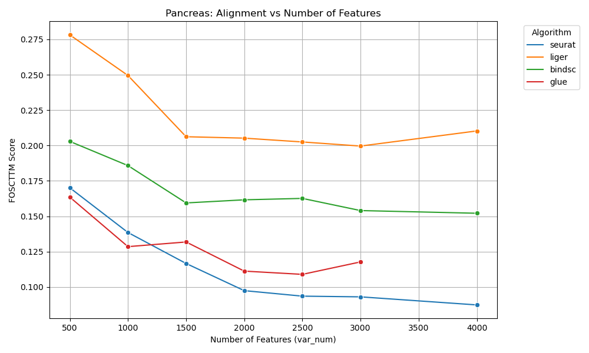
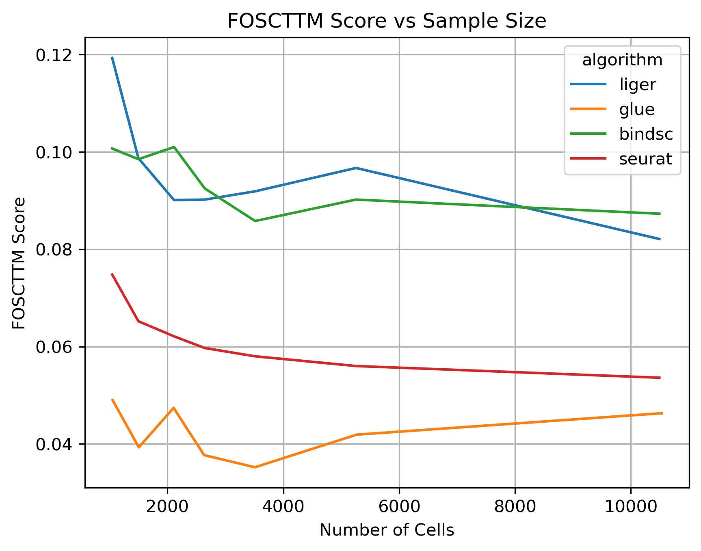
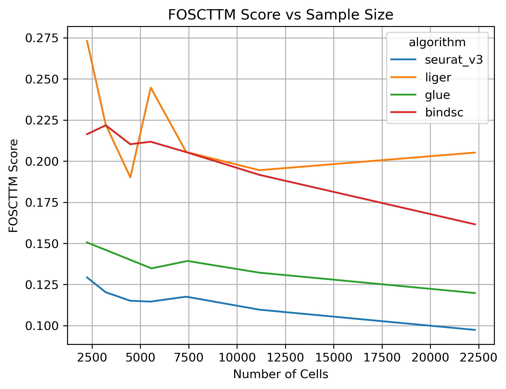
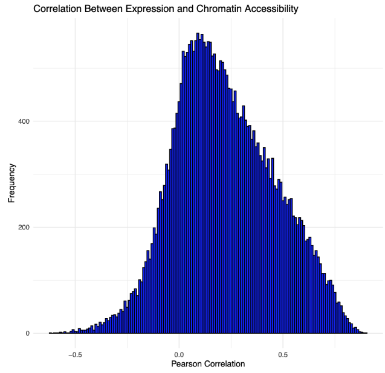

# Benchmarking Algorithms for Multi-omics Single Cell Data Integration Across Unpaired scRNA-seq and scATAC-seq Data.
**Tomoya Furutani**

This repository contains codes and visualizations for benchmarking cross-modality integration across different datasets. Four integration algorithms were evaluated across multiple publicly available datasets. 

## Project Background

Recent advancements in single-cell sequencing technologies have revolutionized biological research; these technologies enable the analysis of cellular heterogeneity and regulatory networks by generating large datasets across various modalities. scRNA-seq provides insights into gene expression by measuring mRNA abundance, while scATAC-seq focuses on open chromatin regions, helping our understanding of regulatory elements. 

Despite the recent advancements in experimental methods that allow for simultaneous measurement of multiple omics modalities at single-cell resolution, most existing datasets only include one modality, presenting challenges for multi-omics integration. A significant issue in the integration of single-modality datasets is that these omics layers have different feature spaces; for scRNA-seq, they are genes while for scATAC-seq, they are peaks corresponding to open-chromatin regions. Therefore they cannot be directly compared. 

However, integration of single-modality data, especially between scRNA-seq and scATAC-seq, allows researchers to identify cell-specific regulatory networks, uncover new cell clusters, and reveal potential biomarkers while taking advantage of the pre-existing single-modality datasets. Thus, growing number of computational tools have been developed to facilitate this process by aligning datasets from two different modalities into a unified latent space. 

In this project, I benchmark four major computational tools developed for scRNA-seq and scATAC-seq integration(Seurat, LIGER, bindSC, and GLUE) across multiple datasets and conditions to evaluate their ability to align the two modalities. Moreover, I will discuss possible ways in which these methods could be improved. 

## Project Walkthrough

### Overview of Benchmarking Strategy

In order to benchmark the performance of these integration algorithms, I used publicly available multimodal datasets that simultaneously profiled gene expression and chromatin accessibility. Then, I treat the datasets for two different modalities as originating from two different single-modality experiments and integrate them using the algorithms. Since these were originally sampled from the same cells, we have the ground truth for cell-to-cell correspondence that allows us to measure the accuracy of the alignment. 

I then visualized the coembedded space generated by each algorithm by Uniform Manifold Approximation and Projection(UMAP) and colored each cell by the original omics type to confirm that each method had successfully mixed the two omics. To quantitvely measure the alignment accuracy of the two modalities, I used FOSCTTM(fraction of cells closer than the true match) which was first introduced by [Liu et al. 2019](https://www.ncbi.nlm.nih.gov/pmc/articles/PMC8496402/). FOSCTTM measures alignment by first calculating the distance matrix beween the data points originating from scRNA-seq and scATAC-seq in the coembedded space. Then, we calculate the proportion of cells of different modality that are closer to the cell than the ground truth-matched cells and take average across all cells measured. 

Let $N$ be the number of cells in each modality and $x$ and $y$ represent the coordinates of cells originating from scRNA-seq and scATAC-seq, respectively. Then, FOSCTTM is

$$FOSCTTM = \frac{1}{N}\left(\sum_{i=1}^N\frac{n_{1, i}}{N}+\sum_{i=1}^{N}\frac{n_{2, i}}{N}\right)$$

where $n_{1, i}$ and $n_{2, i}$ are the number of cells from the other omics that were closer to the cell than the paried cell in the coembedded space. 

### Data Availability

The PBMC dataset used in this project can be downloaded directly from the [10X genomics website](https://www.10xgenomics.com/datasets/pbmc-from-a-healthy-donor-granulocytes-removed-through-cell-sorting-10-k-1-standard-1-0-0). The GTF file used to integrate in scGLUE for this data can also be downloaded from the [10X genomics website](https://www.10xgenomics.com/support/software/cell-ranger/latest/tutorials/cr-tutorial-mr)

The Pancreas dataset used in this project can be downloaded from the [ENCODE project website](https://www.encodeproject.org/) with accession: ENCSR033MDU, ENCSR158DQA, ENCSR233SQG, and ENCSR316WAS. The GTF fiile used was downloaded from [GENCODE(GCh38.p12)](https://www.gencodegenes.org/human/release_29.html)

Finally, the bulk RNA-seq and DNase-seq data analyzed was downloaded from the ENCODE project website as well accessions listed in `accession.txt`

### Pre-processing

All data was initially stored as a Seurat object and filtered based on QC metrics as shown below
```
QC <- function(seurat.obj){
  seurat.obj <- subset(
    x = seurat.obj,
    subset = nCount_ATAC < 7e4 &
      nCount_ATAC > 5e3 &
      nCount_RNA < 25000 &
      nCount_RNA > 1000 &
      percent.mt < 20
  )
  return(seurat.obj)
}
```
`percent.mt` denotes the percentage of reads in scRNA-seq that map to mitochondrial genes. Cells with higher percentage tends to be low-quality or dying cells. After filtering low-quality cells, the data was exported into suitable formats for each algorithm. To run scGLUE, I converted the Seurat object into AnnData object. Then, I ran each algorithm according to the process mentioned in its instructions. 

All four algorithms perform feature selection through choosing 2000 highly variable genes by default. I ran the four algorithms with different number of variable genes from 500 to 4000 and compared their relative performance to assess how the number of features affect the performance of each method. Moreover, to assess how the sample size affects each algorithm, a smaller subset of each data was generated by sampling without replacement as shown below:

Seurat, Liger, bindSC:
```
getSubsample <- function(seurat.obj, k) {
  
  # calculate number of cells in original dataset
  num.cells <- length(Cells(seurat.obj))
  # calculate hte number of cells for the 1/kth sample
  subsample.size <- num.cells %/% k
  subsample <- seurat.obj[, sample(colnames(seurat.obj), size =subsample.size, replace=F)]
  print(paste0("Subsample size: ", length(Cells(subsample))))
  return(subsample)
  
}
```

scGLUE:
```
cells = rna.obs_names
subsample_size = len(cells)//k
subsample_cells = np.random.choice(cells, size=subsample_size, replace=False)
rna = rna[subsample_cells]
atac = atac[subsample_cells]
```
### Integration
After the preprocessing step, I ran the four algorithms with various conditions as described above. All computing was done through the Joint High Performance Computing Exchange at the Johns Hopkins Bloomberg School of Public Health. Seurat, Liger, and bindSC was ran with only CPUs while scGLUE utilized a GPU. Specific code for each algoirthm is in the `methods` directory. The following are some of the UMAP visualizations of the integrated cell embeddings, colored by the original omics:

PBMC(in row-major order, Seurat, Liger, GLUE, bindSC):

Pancreas(in row-major order, Seurat, Liger, GLUE, bindSC):


### Benchmarking
As described in [Overview of Benchmarking Strategy](#overview-of-benchmarking-strategy), I evaluated these methods using FOSCTTM to quantify the alignment of the two modalities. Benchmarking results showed that Seurat and GLUE were top performers when the four algorithms integrated the PBMC and Pancreas dataset with 10,531 cells and 22,304 cells, respectively. As expected, for every method, FOSCTTM tends to trend lower(and thus algoirithm performs better) when ran with more variable features. 



I observed similar results across different sample sizes with both datasets. 



### Conclusion and Future Improvements
In conclusion, GLUE and Seurat consistently outperforms other two methods in integration tasks across datasets and sample sizes. However, GLUE takes significantly longer than the other three methods, even with the use of GPU. In the case of working with a large dataset without a GPU available, Seurat would be the best option for integration tasks.

For a more robust benchmark, I plan to implement benchmarks that evaluate the accuracy of downstream analysis performed after integrating the two modalities. For example, a common downstream task for single-cell data is annotating the cells by cell type. Many of these integration algorithm can annotate the unpaired ATAC-seq cells given a comparative scRNA-seq dataset that is already annotated. Give a multi-modal dataset that is already annotated by cell types, we can implement a benchmark that measures how accurately algorithms annotate the unpaired scATAC cells. 

Finally, I would like to consider ways in which these algorithms could be improved. As mentioned above, scRNA-seq and scATAC-seq are not directly comparable because of the difference in their feature spaces. For RNA-seq, they are genes while for ATAC-seq, they are peaks indicating open chromatin region. All of current state-of-art unpaired integration methods resolve this issue by linking each peak to a gene if the peak overlaps with either the gene body or the promoter region and imputing gene expression from ATAC-seq. However, there are two sources of bias in this process; proximity to a gene is not always a indication of peak-gene linkage, and even if they were linked, the relation is often not linear. To demonstrate this, I took bulk RNA-seq and DNase-seq data from the sample sampe(accessions are provided above) and computed correlation between RNA-seq data and the imputed RNA-seq data from DNase-seq data. 

Specifically, I first generated a peak to gene conversion matrix using the `GenomicRanges` package as follows:
```
gtf <- import("/Users/wunfs1010/Downloads/jilab_code/integration_filter/genes.gtf")
genes <- Features(pbmc.rna)
peaks <- granges(pbmc.atac)

extend <- function(x, upstream=0, downstream=0) {
  if (any(strand(x) == "*"))
    warning("'*' ranges were treated as '+'")
  on_plus <- strand(x) == "+" | strand(x) == "*"
  new_start <- start(x) - ifelse(on_plus, upstream, downstream)
  new_end <- end(x) + ifelse(on_plus, downstream, upstream)
  ranges(x) <- IRanges(new_start, new_end)
  trim(x)
}

gtf <- extend(gtf, upstream=3000)

gtf$gene_id <- sapply(strsplit(gtf$gene_id,"\\."), function(x) x[1])
gtf <- gtf[(elementMetadata(gtf)[["gene_id"]] %in% genes)]
gtf <- gtf[(elementMetadata(gtf)[["type"]] == "gene")]

hits <- findOverlaps(gtf, peaks)
hits <- as.matrix(hits)
colnames(hits) <- c("gene_index", "peak_index")
rows <- hits[,"gene_index"]
cols <- hits[,"peak_index"]
gene.activity.mat <- sparseMatrix(i = rows, j = cols, x = rep(1, length(rows)), dims=c(length(genes), length(peaks)))
```
I then multiplied the matrix to the ATAC peak by cell matrix to impute the gene expression data and calculated the pearson correlation for each gene with the RNA-seq data. After calculating the correlation for all genes, I plotted the distribution of these correlations using a histogram, revealing that while many genes have very little correlation between chromatin accessibility and gene expression. 



Thus, methods that account for the complex and non-linear relationship between chromatin accessibility and gene expression to better impute gene expression could perform better then the existing algorithms. This can be done by taking advantage of the available public multimodal datasets to learn the relationship between regions of the genome and specific genes. 